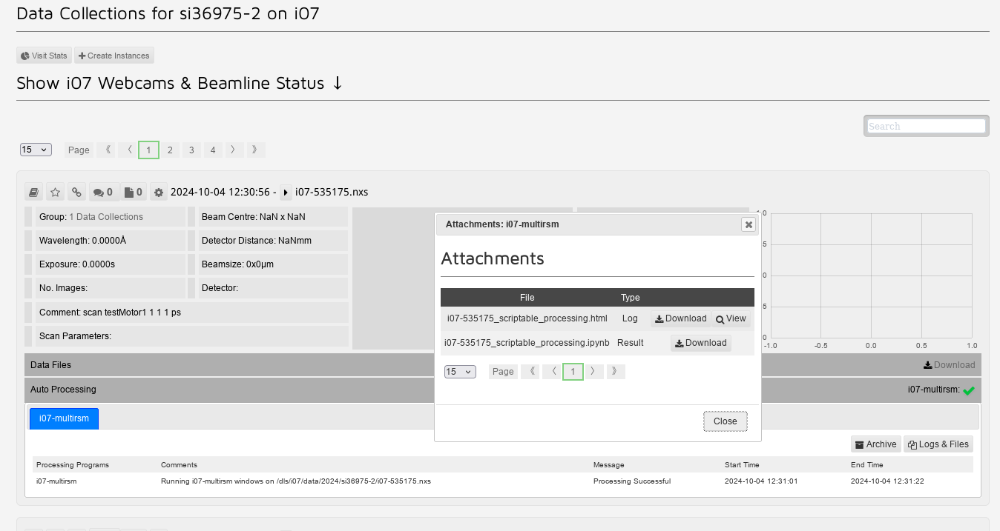
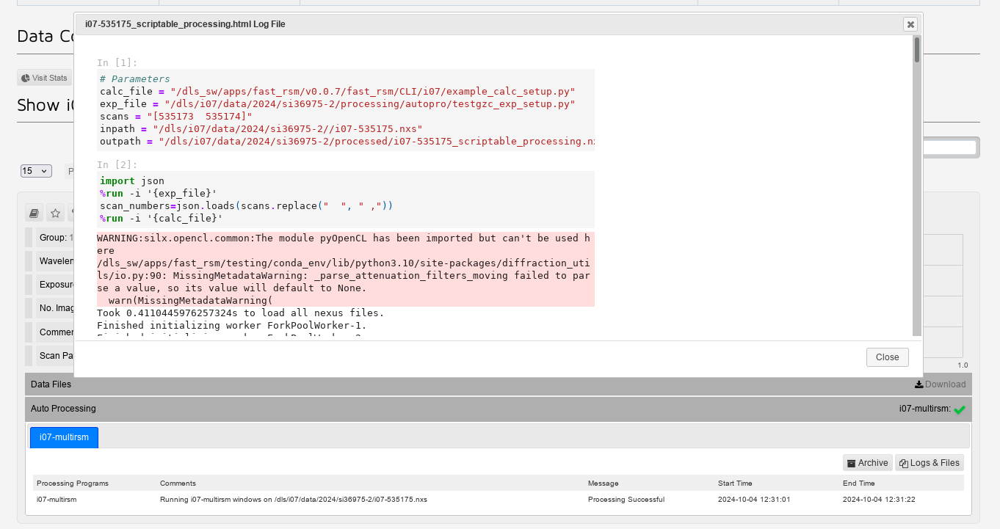

Running processing jobs directly after scan from script in gda
===============================================================

In GDA open and run the following script:

.. code-block:: bash

    /dls_sw/i07/scripts/gda-zocalo/test_zocalo_functions.py

this will allow you to access the functions *mapstart*, *currentScan*, *mapend*

To create a map to be sent for processing automatically, the format is as follows 

**NOTE: the output directory within your experiment file needs to be the 'processed' folder in your experiment directory and not the 'processing' folder**

.. code-block:: bash

    #define exp_setup and calc_setup files
    #enter latest version of example_calc_setup.py - do module load fast_rsm on a new terminal, and see what version fast_rsm v#### number is loaded
    calc_file="/dls_sw/apps/fast_rsm/v0.0.7/fast_rsm/CLI/i07/example_calc_setup.py"
    
    exp_file="path/to/exp_setup.py"
    
    
    #start of new map
    scanlist,ps=mapstart()
    
    #collect scans that make up the map, using append(currentScan) to add scans to list
    for i in range (1,4,1):
        scan testMotor1 1 1 1
        scanlist.append(currentscan())
    
    #use mapend function to send off scans. Format   mapend(scanlist,ps,setup_files):
    mapend(scanlist,ps,[exp_file,calc_file])

You can then collect and process a second map by repeating the code from scanlist,ps=mapstart() onwards.

Additionally  you can change the exp_file after the first map has finished if a different type of processing is required for the second map

An example macro script is located here /dls_sw/i07/scripts/gda-zocalo/example_gzc_script.py

to monitor progress go to https://ispyb.diamond.ac.uk/dc/visit/si######  using your experiment number

if processing has gone correctly there will be an entry on the webpage with a green tick. 

clicking the auto processing line for the entry gives options for 'Logs & Files'. Selecting this opens a window show the extra attachments you can view. 

from this you can select the 'View' option on the top line, which will open a scrollable window where you can see the code that was run for the processing, as well as any error messages that were output

